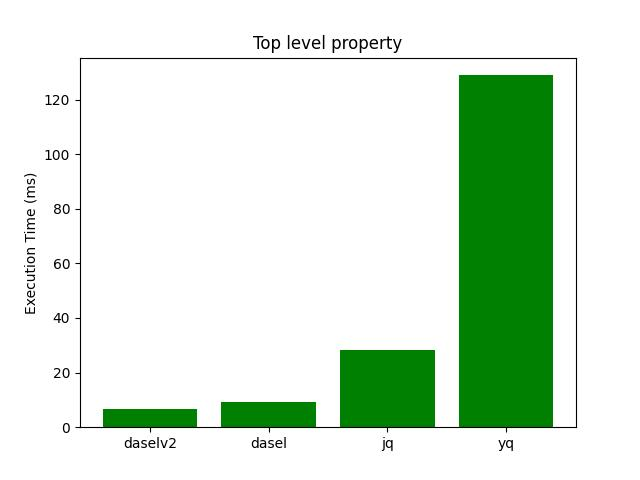
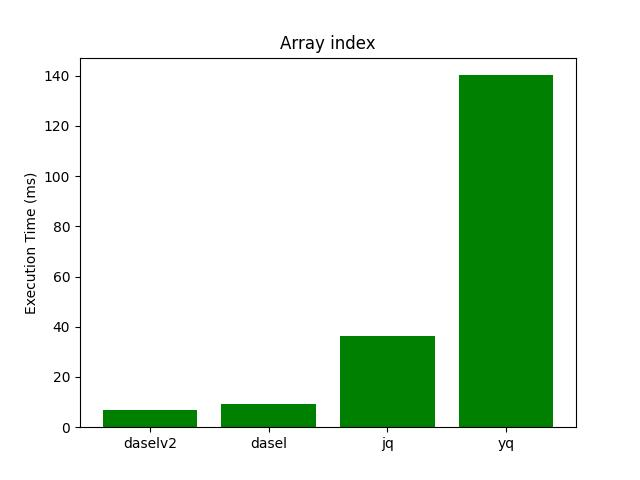
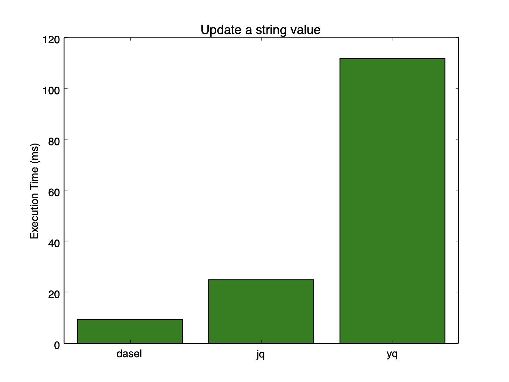
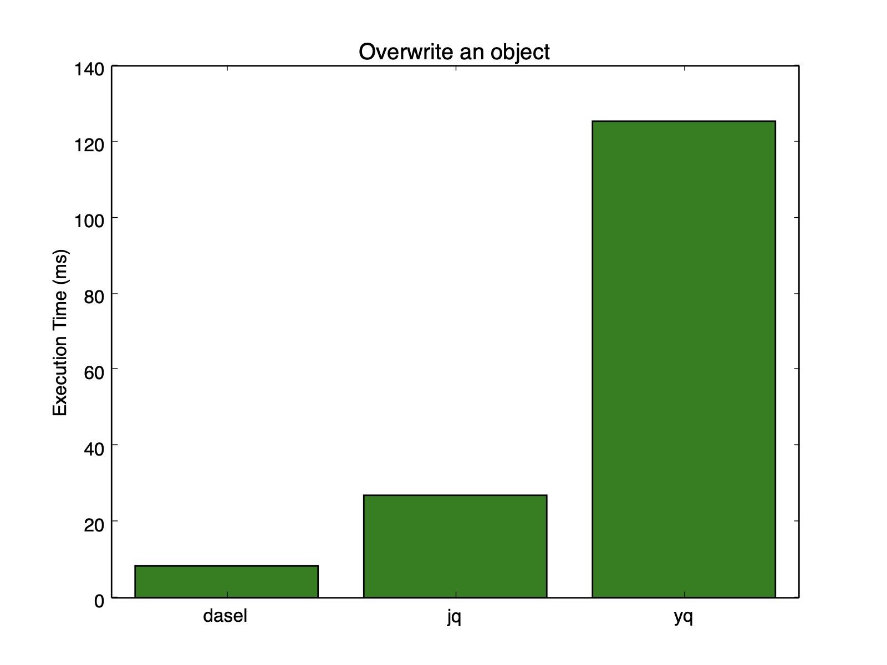
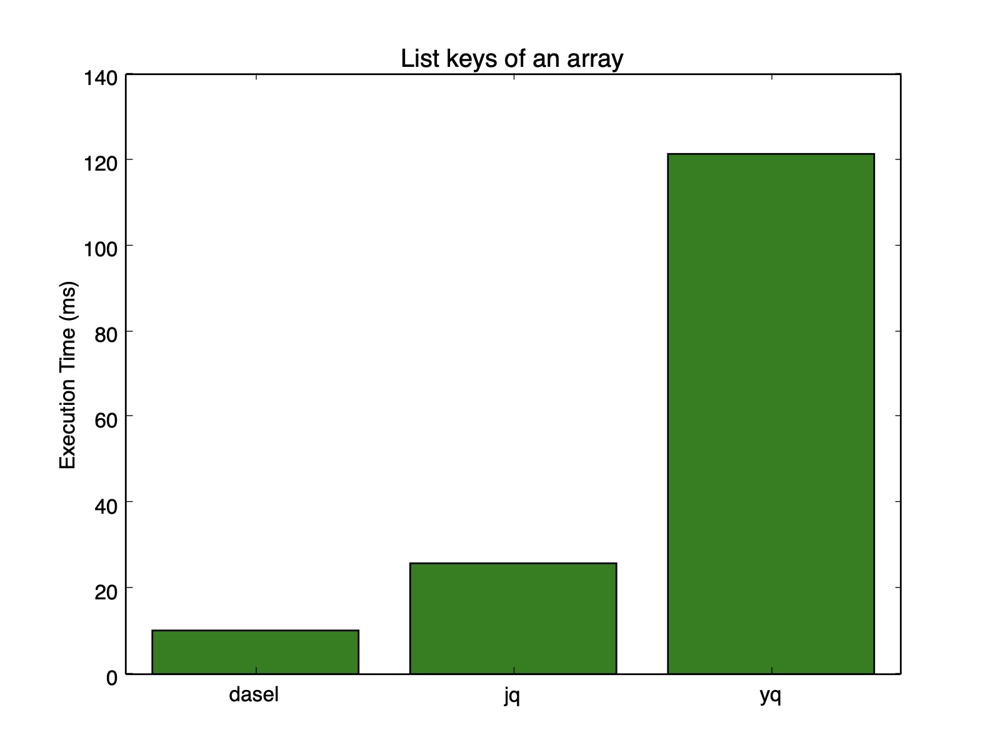
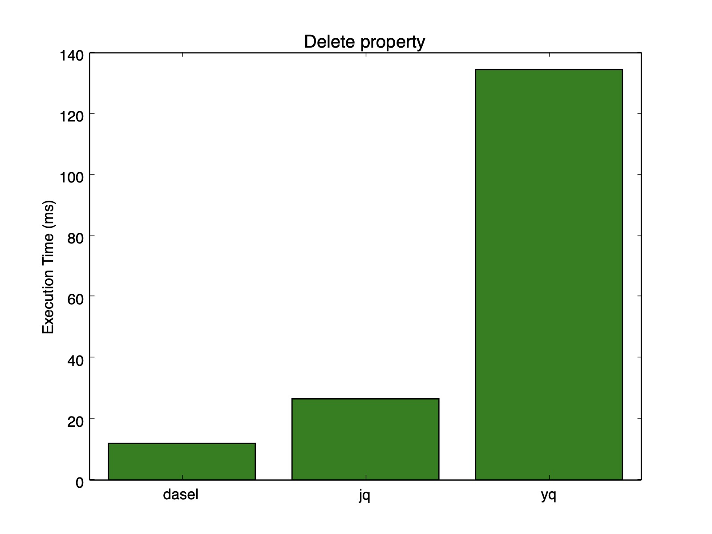

# Benchmarks

These benchmarks are auto generated using `./benchmark/run.sh`.

```
brew install hyperfine
pip install matplotlib
./benchmark/run.sh
```

I have put together what I believe to be equivalent commands in dasel/jq/yq.

If you have any feedback or wish to add new benchmarks please submit a PR.
## Benchmarks

### Root Object


| Command | Mean [ms] | Min [ms] | Max [ms] | Relative |
|:---|---:|---:|---:|---:|
| `daselv2 -f benchmark/data.json` | 6.6 ± 0.2 | 6.1 | 7.2 | 1.00 |
| `dasel -f benchmark/data.json` | 8.7 ± 0.5 | 8.0 | 10.3 | 1.33 ± 0.09 |
| `jq '.' benchmark/data.json` | 28.1 ± 0.7 | 27.0 | 31.5 | 4.28 ± 0.19 |
| `yq --yaml-output '.' benchmark/data.yaml` | 127.9 ± 3.1 | 124.5 | 151.6 | 19.50 ± 0.84 |

### Top level property



| Command | Mean [ms] | Min [ms] | Max [ms] | Relative |
|:---|---:|---:|---:|---:|
| `daselv2 -f benchmark/data.json 'id'` | 6.6 ± 0.2 | 6.1 | 7.4 | 1.00 |
| `dasel -f benchmark/data.json '.id'` | 8.3 ± 0.3 | 7.8 | 9.7 | 1.27 ± 0.06 |
| `jq '.id' benchmark/data.json` | 28.2 ± 0.9 | 27.1 | 31.5 | 4.31 ± 0.21 |
| `yq --yaml-output '.id' benchmark/data.yaml` | 128.4 ± 10.1 | 124.4 | 211.7 | 19.59 ± 1.71 |

### Nested property


| Command | Mean [ms] | Min [ms] | Max [ms] | Relative |
|:---|---:|---:|---:|---:|
| `daselv2 -f benchmark/data.json 'user.name.first'` | 6.5 ± 0.2 | 6.1 | 7.3 | 1.00 |
| `dasel -f benchmark/data.json '.user.name.first'` | 8.3 ± 0.3 | 7.9 | 9.9 | 1.28 ± 0.07 |
| `jq '.user.name.first' benchmark/data.json` | 28.2 ± 0.9 | 27.0 | 32.9 | 4.34 ± 0.22 |
| `yq --yaml-output '.user.name.first' benchmark/data.yaml` | 126.7 ± 2.1 | 124.5 | 138.2 | 19.52 ± 0.81 |

### Array index



| Command | Mean [ms] | Min [ms] | Max [ms] | Relative |
|:---|---:|---:|---:|---:|
| `daselv2 -f benchmark/data.json 'favouriteNumbers.[1]'` | 6.5 ± 0.2 | 6.0 | 7.5 | 1.00 |
| `dasel -f benchmark/data.json '.favouriteNumbers.[1]'` | 8.6 ± 0.7 | 7.9 | 11.3 | 1.33 ± 0.12 |
| `jq '.favouriteNumbers[1]' benchmark/data.json` | 28.4 ± 1.6 | 27.3 | 38.1 | 4.36 ± 0.29 |
| `yq --yaml-output '.favouriteNumbers[1]' benchmark/data.yaml` | 128.3 ± 9.2 | 124.2 | 213.8 | 19.69 ± 1.59 |

### Append to array of strings


| Command | Mean [ms] | Min [ms] | Max [ms] | Relative |
|:---|---:|---:|---:|---:|
| `daselv2 put -f benchmark/data.json -t string -v 'blue' -o - 'favouriteColours.[]'` | 6.6 ± 0.3 | 6.1 | 8.3 | 1.00 |
| `dasel put string -f benchmark/data.json -o - '.favouriteColours.[]' blue` | 8.4 ± 0.3 | 7.8 | 9.2 | 1.28 ± 0.07 |
| `jq '.favouriteColours += ["blue"]' benchmark/data.json` | 28.3 ± 0.9 | 27.4 | 32.7 | 4.31 ± 0.25 |
| `yq --yaml-output '.favouriteColours += ["blue"]' benchmark/data.yaml` | 127.6 ± 2.4 | 124.1 | 140.3 | 19.45 ± 1.01 |

### Update a string value



| Command | Mean [ms] | Min [ms] | Max [ms] | Relative |
|:---|---:|---:|---:|---:|
| `daselv2 put -f benchmark/data.json -t string -v 'blue' -o - 'favouriteColours.[0]'` | 6.6 ± 0.3 | 6.1 | 7.4 | 1.00 |
| `dasel put string -f benchmark/data.json -o - '.favouriteColours.[0]' blue` | 9.5 ± 1.7 | 8.0 | 12.9 | 1.45 ± 0.27 |
| `jq '.favouriteColours[0] = "blue"' benchmark/data.json` | 28.5 ± 1.3 | 27.3 | 33.1 | 4.33 ± 0.26 |
| `yq --yaml-output '.favouriteColours[0] = "blue"' benchmark/data.yaml` | 127.3 ± 2.7 | 125.0 | 149.4 | 19.36 ± 0.86 |

### Overwrite an object



| Command | Mean [ms] | Min [ms] | Max [ms] | Relative |
|:---|---:|---:|---:|---:|
| `daselv2 put -f benchmark/data.json -o - -t json -v '{"first":"Frank","last":"Jones"}' 'user.name'` | 6.3 ± 0.3 | 6.0 | 7.2 | 1.00 |
| `dasel put document -f benchmark/data.json -o - -d json '.user.name' '{"first":"Frank","last":"Jones"}'` | 8.3 ± 0.3 | 7.8 | 9.6 | 1.31 ± 0.07 |
| `jq '.user.name = {"first":"Frank","last":"Jones"}' benchmark/data.json` | 28.2 ± 1.0 | 27.2 | 31.7 | 4.45 ± 0.23 |
| `yq --yaml-output '.user.name = {"first":"Frank","last":"Jones"}' benchmark/data.yaml` | 127.5 ± 2.5 | 124.6 | 143.8 | 20.10 ± 0.89 |

### List keys of an array



| Command | Mean [ms] | Min [ms] | Max [ms] | Relative |
|:---|---:|---:|---:|---:|
| `daselv2 -f benchmark/data.json 'all().key()'` | 6.4 ± 0.3 | 6.0 | 7.4 | 1.00 |
| `dasel -f benchmark/data.json -m '.-'` | 8.3 ± 0.3 | 7.8 | 9.6 | 1.30 ± 0.07 |
| `jq 'keys[]' benchmark/data.json` | 28.1 ± 1.0 | 27.1 | 32.1 | 4.41 ± 0.24 |
| `yq --yaml-output 'keys[]' benchmark/data.yaml` | 126.6 ± 2.1 | 123.7 | 138.3 | 19.82 ± 0.88 |

### Delete property



| Command | Mean [ms] | Min [ms] | Max [ms] | Relative |
|:---|---:|---:|---:|---:|
| `daselv2 delete -f benchmark/data.json -o - 'id'` | 6.5 ± 0.3 | 6.1 | 8.2 | 1.00 |
| `dasel delete -f benchmark/data.json -o - '.id'` | 8.4 ± 0.3 | 7.9 | 10.1 | 1.30 ± 0.08 |
| `jq 'del(.id)' benchmark/data.json` | 28.3 ± 0.9 | 27.4 | 32.0 | 4.38 ± 0.24 |
| `yq --yaml-output 'del(.id)' benchmark/data.yaml` | 127.5 ± 2.7 | 124.7 | 147.3 | 19.74 ± 0.99 |
